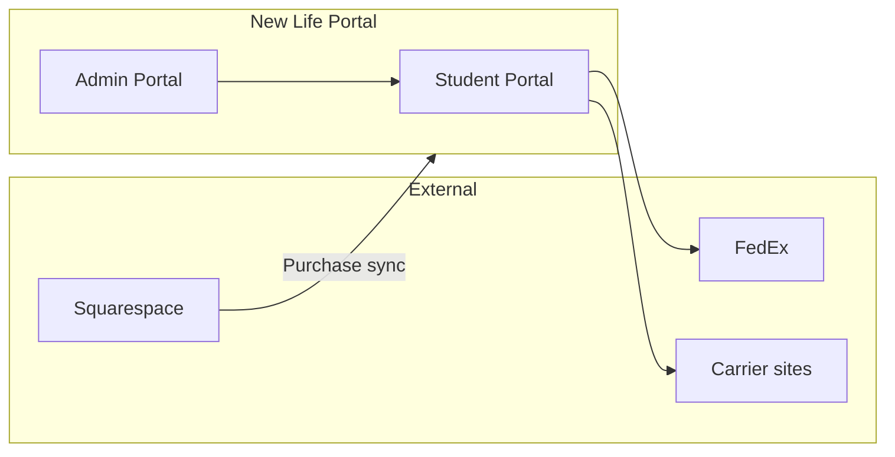

# Platform Overview

**Project:** New Life Campus Portal  
**Client:** New Life Campus / New Life Logistix  
**Document:** Platform overview (derived from FSD v1.0)  
**MVP target:** July 1, 2026

---

## 1. Objective

The New Life Campus Portal is a logistics coordination and operational visibility platform for student dorm move-in workflows.

### MVP delivers

- Customer-facing post-purchase portal
- Logistics visibility system
- Move-in coordination platform
- Internal operations dashboard
- Mobile-friendly operational experience

### MVP priorities

| Priority | Focus |
|----------|--------|
| Workflow clarity | Clear step-by-step move-in journey |
| Operational visibility | Admin sees status across students, containers, packages |
| Customer confidence | Progress tracker, deadlines, notifications |
| Mobile usability | Responsive TailAdmin-based UI |
| Core logistics | Retail packages, containers, deliveries |
| Operational flexibility | Manual overrides, flags, admin edits |

---

## 2. Platform boundary

### Squarespace (external)

- Public marketing website
- Package selection and payment
- Checkout flow
- **Not built in this codebase**

### New Life Portal (this system)

- Customer onboarding and profile
- Retail package logging
- Container visibility and move tracking
- Shipment tracking (links + manual status)
- Delivery coordination
- Notifications (SMS, email, in-app)
- Internal operations management
- Delivery confirmations
- Reporting and CSV exports

---

## 3. User roles

| Role | Portal access | Description |
|------|---------------|-------------|
| **Student / Customer** | Yes | Purchased package via Squarespace; completes onboarding and manages move |
| **Parent / Guardian** | No (MVP) | Receives notifications; data captured in student profile |
| **Admin / Operations** | Yes | Manages customers, containers, packages, deliveries, support |

---

## 4. Technical principles

- **Framework:** Laravel 12, service-based architecture
- **UI:** Blade + Tailwind (TailAdmin structure), Alpine.js, Vite
- **Auth:** Email/password, session-based; no public self-registration
- **Database:** Schema changes only via `database/migrations/` (never direct ALTER)
- **Testing:** Pest feature/unit tests; PHPCS PSR-12; PHPStan (Larastan)
- **CI:** GitHub Actions (`.github/workflows/ci.yml`)

---

## 5. Current implementation status

| Area | Status |
|------|--------|
| Student/admin UI shell | Done (static mock data) |
| Login/logout + role middleware | Done (demo accounts) |
| Listing tables (DataTables) | Done (UI only) |
| Domain models & workflows | Not started |
| Squarespace integration | Not started |
| Notifications (SMS/email) | Not started |
| File storage (photos) | Not started |

---

## 6. Deferred / out of scope (MVP)

Per FSD §21.2 — document only; do not build in MVP:

- In-portal payments, Apple Pay, ACH
- Refund management
- Multi-university support
- Advanced analytics
- Complex barcode scanning
- Deep automation workflows
- Automated carrier API sync (FedEx, Amazon, etc.)
- Push notifications (mobile app)

### Phase 2 candidates (FSD §21.3)

- Advanced barcode scanning
- Automated FedEx integrations
- Amazon tracking automation
- Push notifications
- Multi-school support
- Advanced analytics and permissions

---

## 7. UX and branding

- Align with New Life branding and Squarespace visual direction
- TailAdmin dashboard structure (already in use)
- Clean layout, mobile-first, parent-friendly copy
- Operational clarity for admin users

---

## 8. Global open questions (FSD §23)

Track resolution in module READMEs; summary:

| # | Question | Owner module |
|---|----------|--------------|
| 1 | Final registration field confirmation | [02-onboarding-profile](modules/02-onboarding-profile/) |
| 2 | Carrier API feasibility | [06](modules/06-retail-packages/), [07](modules/07-containers-move/) |
| 3 | Container return tracking sync approach | [07-containers-move](modules/07-containers-move/) |
| 4 | Final package limits per customer/tier | [06-retail-packages](modules/06-retail-packages/) |
| 5 | July 1 launch acceleration feasibility | Program management |
| 6 | Brand guideline delivery | Design |
| 7 | Operational workflow refinements | [14-operational-management](modules/14-operational-management/) |
| 8 | Squarespace sync contract (fields, webhooks) | [01-authentication](modules/01-authentication/) |

---

## 9. Related documents

- [Documentation index](README.md) — module list and build order
- [Module folders](modules/) — per-module requirements
