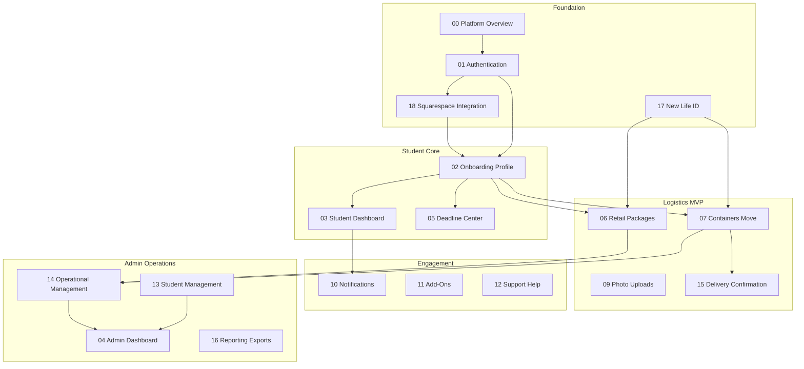

# New Life Campus Portal — Documentation Index

Module-by-module functional requirements for review before implementation. Derived from the Functional Specification Document (FSD) v1.0.

**MVP launch target:** July 1, 2026

---

## How to use these docs

1. Read [00-platform-overview.md](00-platform-overview.md) for scope and boundaries.
2. Review modules in **build order** (below), one folder at a time.
3. Sign off each module’s acceptance criteria before development starts.
4. Implementation uses `database/migrations/` for all schema changes.

### Standard files per module

| File | Purpose |
|------|---------|
| `README.md` | Summary, dependencies, open questions |
| `student.md` | Student portal features (if applicable) |
| `admin.md` | Admin portal features (if applicable) |
| `technical-notes.md` | Models, services, migrations, integrations |

---

## Module dependency diagram

---

## Module index

| # | Module | Priority | Student doc | Admin doc | Folder |
|---|--------|----------|-------------|-----------|--------|
| 00 | Platform overview | Reference | — | — | [00-platform-overview.md](00-platform-overview.md) |
| 01 | Authentication | P0 | Yes | Yes | [modules/01-authentication/](modules/01-authentication/) |
| 02 | Onboarding & profile | P0 | Yes | Yes | [modules/02-onboarding-profile/](modules/02-onboarding-profile/) |
| 03 | Student dashboard | P0 | Yes | — | [modules/03-student-dashboard/](modules/03-student-dashboard/) |
| 04 | Admin dashboard | P0 | — | Yes | [modules/04-admin-dashboard/](modules/04-admin-dashboard/) |
| 05 | Deadline center | P1 | Yes | Yes | [modules/05-deadline-center/](modules/05-deadline-center/) |
| 06 | Retail packages | **P0 critical** | Yes | Yes | [modules/06-retail-packages/](modules/06-retail-packages/) |
| 07 | Containers & move | P0 | Yes | Yes | [modules/07-containers-move/](modules/07-containers-move/) |
| 08 | Deliveries | P0 | View | Yes | [modules/08-deliveries/](modules/08-deliveries/) |
| 09 | Photo uploads | P1 | Yes | Yes | [modules/09-photo-uploads/](modules/09-photo-uploads/) |
| 10 | Notifications | P1 | Yes | Yes | [modules/10-notifications/](modules/10-notifications/) |
| 11 | Add-ons | P2 | Yes | Yes | [modules/11-add-ons/](modules/11-add-ons/) |
| 12 | Support & help | P1 | Yes | Yes | [modules/12-support-help/](modules/12-support-help/) |
| 13 | Student management | P0 | — | Yes | [modules/13-student-management/](modules/13-student-management/) |
| 14 | Operational management | P0 | — | Yes | [modules/14-operational-management/](modules/14-operational-management/) |
| 15 | Delivery confirmation | P1 | View | Yes | [modules/15-delivery-confirmation/](modules/15-delivery-confirmation/) |
| 16 | Reporting & exports | P2 | — | Yes | [modules/16-reporting-exports/](modules/16-reporting-exports/) |
| 17 | New Life ID | P0 | Display | Manage | [modules/17-new-life-id/](modules/17-new-life-id/) |
| 18 | Squarespace integration | P0 | — | — | [modules/18-squarespace-integration/](modules/18-squarespace-integration/) |

**Parent/guardian:** No separate login in MVP — see [02-onboarding-profile](modules/02-onboarding-profile/) and [10-notifications](modules/10-notifications/).

---

## Build order checklist

Use this sequence for documentation review and implementation.

### Phase 0 — Foundation

- [ ] [00-platform-overview.md](00-platform-overview.md)
- [ ] [01-authentication](modules/01-authentication/)
- [ ] [18-squarespace-integration](modules/18-squarespace-integration/)
- [ ] [17-new-life-id](modules/17-new-life-id/)

### Phase 1 — Core portal

- [ ] [02-onboarding-profile](modules/02-onboarding-profile/)
- [ ] [03-student-dashboard](modules/03-student-dashboard/)
- [ ] [04-admin-dashboard](modules/04-admin-dashboard/)
- [ ] [13-student-management](modules/13-student-management/)

### Phase 2 — Logistics MVP (critical path)

- [ ] [06-retail-packages](modules/06-retail-packages/)
- [ ] [07-containers-move](modules/07-containers-move/)
- [ ] [14-operational-management](modules/14-operational-management/)

### Phase 3 — Operations & engagement

- [ ] [08-deliveries](modules/08-deliveries/)
- [ ] [05-deadline-center](modules/05-deadline-center/)
- [ ] [10-notifications](modules/10-notifications/)
- [ ] [12-support-help](modules/12-support-help/)

### Phase 4 — Enhancements

- [ ] [09-photo-uploads](modules/09-photo-uploads/)
- [ ] [15-delivery-confirmation](modules/15-delivery-confirmation/)
- [ ] [11-add-ons](modules/11-add-ons/)
- [ ] [16-reporting-exports](modules/16-reporting-exports/)

---

## Existing codebase mapping

| Portal | Base path | Layout |
|--------|-----------|--------|
| Student | `/student/*` | `resources/views/layouts/app.blade.php` |
| Admin | `/admin/*` | Same layout, `portal=admin` |
| Auth | `/login`, `/logout` | `resources/views/pages/portal/login.blade.php` |

Menu definitions: `app/Helpers/MenuHelper.php`

---

## Implementation standards (all modules)

- Service classes in `app/Services/`
- Form requests for validation
- Policies for authorization
- Migrations in `database/migrations/` only
- Pest tests per module acceptance criteria
- No `console.log` in frontend (use `console.debug` / `console.warn` / `console.error` if needed)
