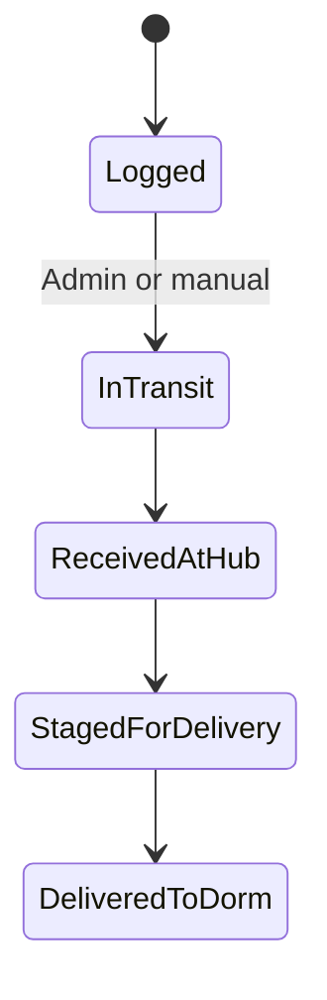

# Retail Packages — Student

**FSD:** §8.1–§8.6

## 1. Purpose

Register packages purchased from external retailers so warehouse can accept and deliver them.

## 2. User stories

| ID | Story |
|----|-------|
| S-R1 | As a student, I add a retail package with retailer and tracking info. |
| S-R2 | As a student, I edit a package before it is received at hub. |
| S-R3 | As a student, I see status of all my packages. |
| S-R4 | As a student, I acknowledge only logged packages are accepted. |

## 3. Route

`/student/retail-packages`

## 4. Form fields

| Field | Required | Notes |
|-------|----------|-------|
| Retailer name | Yes | Amazon, Walmart, Target, Wayfair, DHL, UPS, FedEx, Other |
| Item description | Yes | Free text |
| Tracking number | Yes | Validated format optional |
| Estimated arrival date | Yes | Date |
| Notes | No | Optional |

## 5. Status workflow

| Status | Label |
|--------|-------|
| `logged` | Logged |
| `in_transit` | In Transit |
| `received_at_hub` | Received at Hub |
| `staged_for_delivery` | Staged for Delivery |
| `delivered_to_dorm` | Delivered to Dorm |

## 6. Business rules

| Rule | Detail |
|------|--------|
| Package cap | ~10 active (non-delivered) per student — configurable |
| Acknowledgement | Required checkbox on first add per season |
| Name + NL ID | Display reminder on form |
| Late packages | Warning: may not be guaranteed |
| Restricted items | Prohibited list acknowledgement |
| Edit lock | No edit after `received_at_hub` (configurable) |

## 7. Tracking (MVP)

- Manual status by admin
- External carrier link (constructed URL from retailer + tracking #)
- No carrier API in MVP

## 8. Notifications

| Event | Channels |
|-------|----------|
| Package received at hub | Email, SMS, in-app |
| Delivered to dorm | Email, SMS, in-app |

## 9. Acceptance criteria

- [ ] Student can CRUD packages within cap and status rules.
- [ ] List shows all packages with sortable/searchable table.
- [ ] Acknowledgement required before first submission.
- [ ] Tracking link opens carrier site when available.
- [ ] Cannot exceed active package limit.
