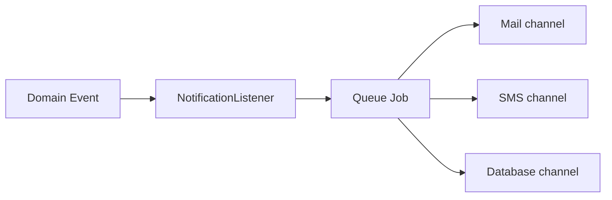

# Notifications — Technical Notes

## Architecture

## Models

| Model | Purpose |
|-------|---------|
| `NotificationPreference` | Per user channel toggles |
| `NotificationLog` | Sent messages audit |
| Laravel `notifications` table | In-app |

## Packages

- Laravel Notifications
- Twilio SDK (SMS) or AWS SNS

## Templates

Blade/Markdown templates in `resources/views/mail/portal/`

## Jobs

`SendPortalNotificationJob` — queued, retry 3x

## Tests

- Preference disables SMS
- Event triggers correct template
- In-app notification created
