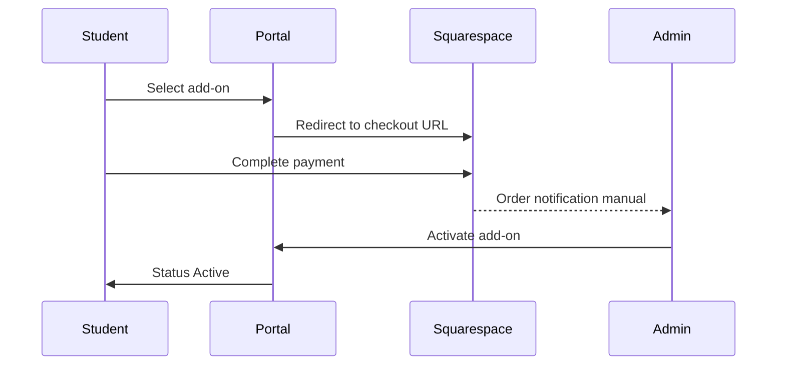

# Add-Ons — Student

**FSD:** §12.1–§12.3

## 1. Purpose

Purchase additional services beyond base package.

## 2. Supported add-ons (examples)

| Add-on | Description |
|--------|-------------|
| Additional containers | Extra container units |
| Storage extension | Extended hub storage |
| Retail package receiving | Increased package cap |
| Delivery upgrades | Priority delivery window |

## 3. Workflow

## 4. Statuses

| Status | Meaning |
|--------|---------|
| Requested | Student initiated |
| Payment Pending | Awaiting Squarespace payment |
| Active | Admin activated |

## 5. UI (`/student/add-ons`)

| Section | Content |
|---------|---------|
| Available | Cards with description + "Purchase" CTA |
| My add-ons | Table of requested/active |
| Payment pending | Clear next steps |

## 6. Dashboard integration

Add-on summary widget on student dashboard (module 03).

## 7. Acceptance criteria

- [ ] Purchase button opens correct Squarespace URL with student identifier query param.
- [ ] Requested add-on appears in My add-ons with Payment Pending.
- [ ] Active add-ons affect entitlements (e.g. package cap).
- [ ] Student cannot mark add-on active themselves.
